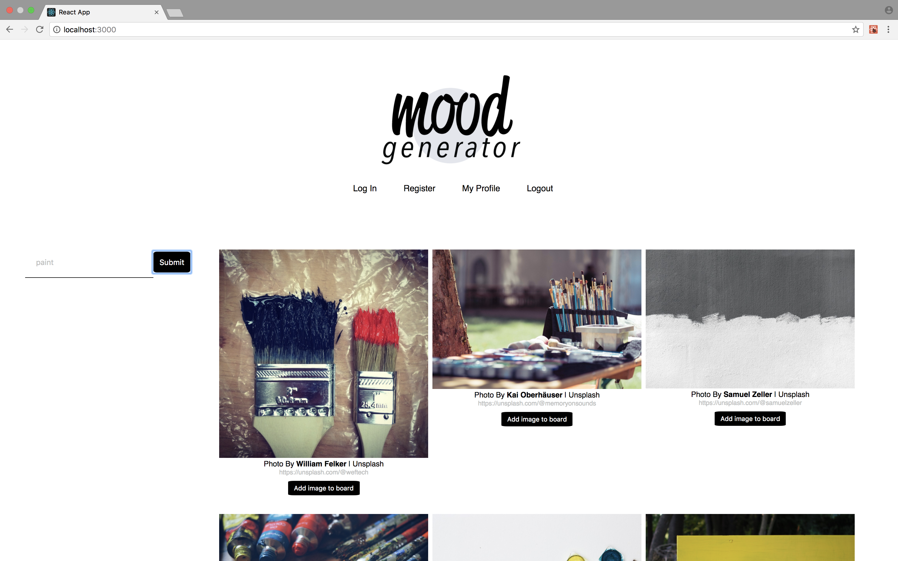
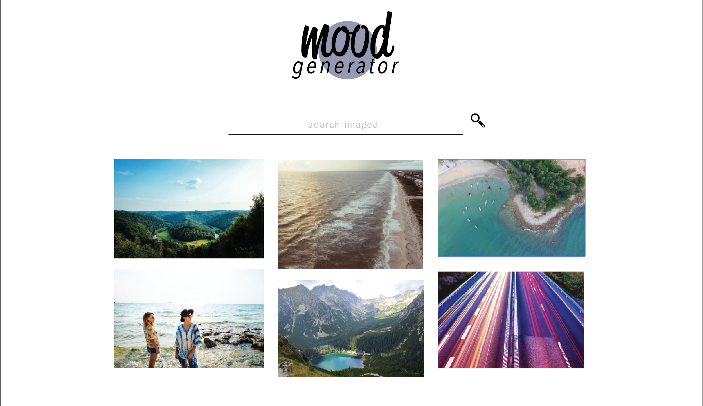
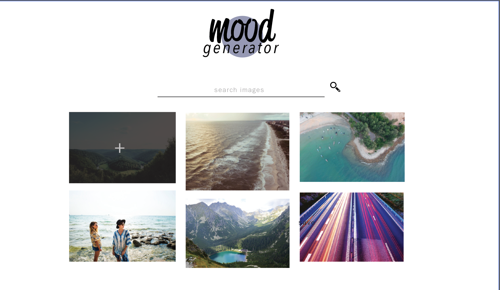
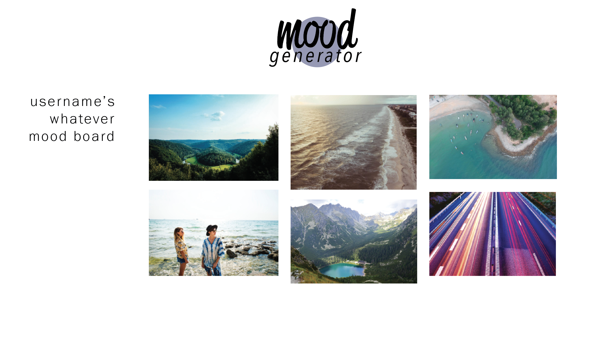

## Project 4 - Mood Generator

### Technologies Used
For this project the backend was generated in express, and the front end was created using React.

### Approach

When it first came to creating this app I started to use Ruby, however I changed to use express. I first made an overall design of how I wanted the app to look, which would help me create the components in React. I then started to create the axios call to render the images, then created the back end which is fully functioning.

Once the back end was creating I worked more in react to get the moldboards rendering, and working to only show specific moodboards based on if the user was logged in or not, or if they create that specific moodboard.

### User Stories
Once the user opens the page the images will load from the unsplash api that has been generated from the top images of the day. The user can filter through the api to search for an image they want to find from the search bar. The user can then sign in, and create a new moodboard to their account. The user is only able to view their moodboards only. The user can then go back to the images page and save the images to a specific moodboard that they have created. The user can then view that moodboard and see all the saved images.

### Wire Frames

### Unsolved Problems and Hurdles
Since I changed my project pretty late I had a lot of trouble finishing this on time. My back end is functioning but I had a lot of problems with the different states in react. When it came to saving an image to a moodboard, I did not have the right state of the both the user id and the moodboard id to save the image to the specific user or moodboard. Also I should have started using exact paths, because a lot of my routes aren’t fully functioning and rendering the correct component on the setPage state.

Overall there is a lot with this project I need to work on and continue to change and update. Not really happy with the outcome as of right now given the amount of time I had, so this is still a work in progress.
